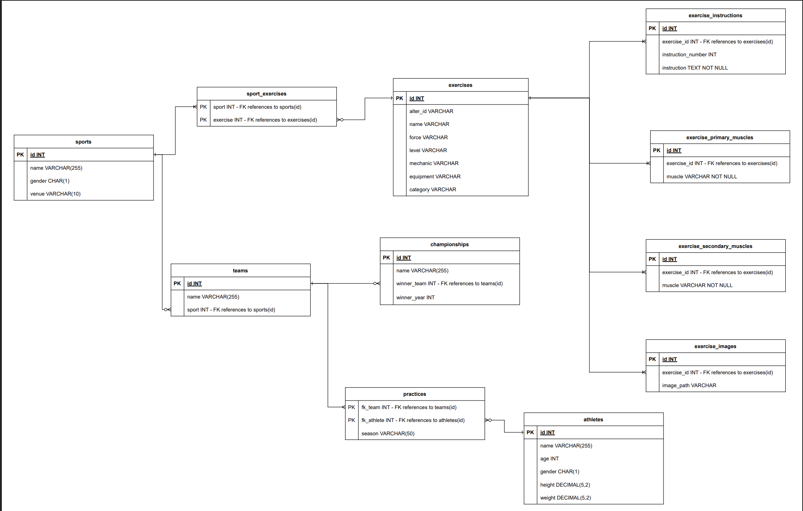
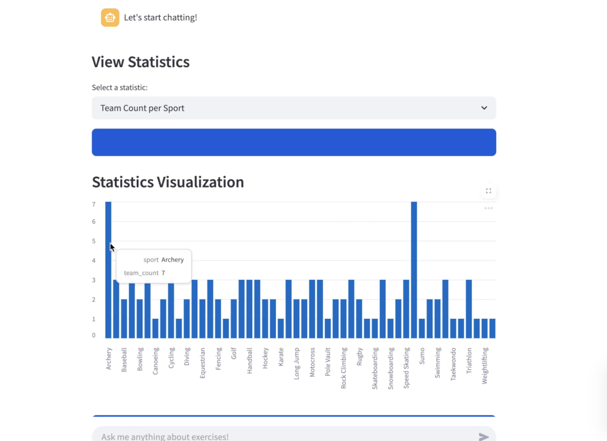
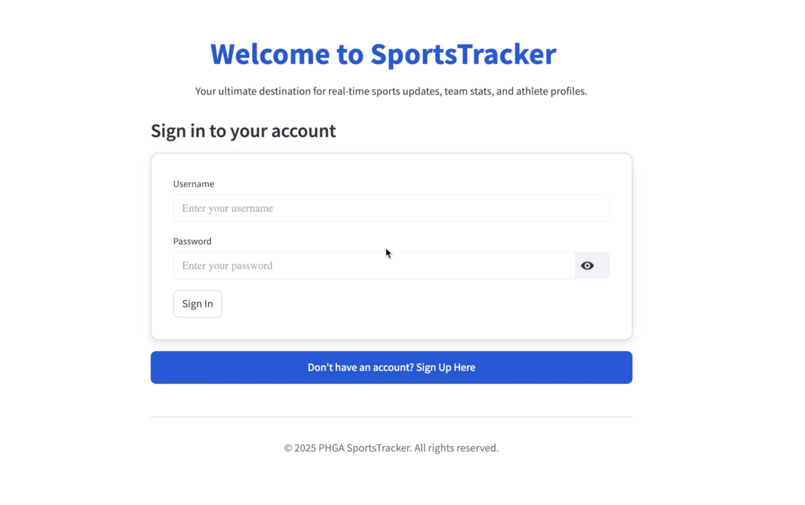
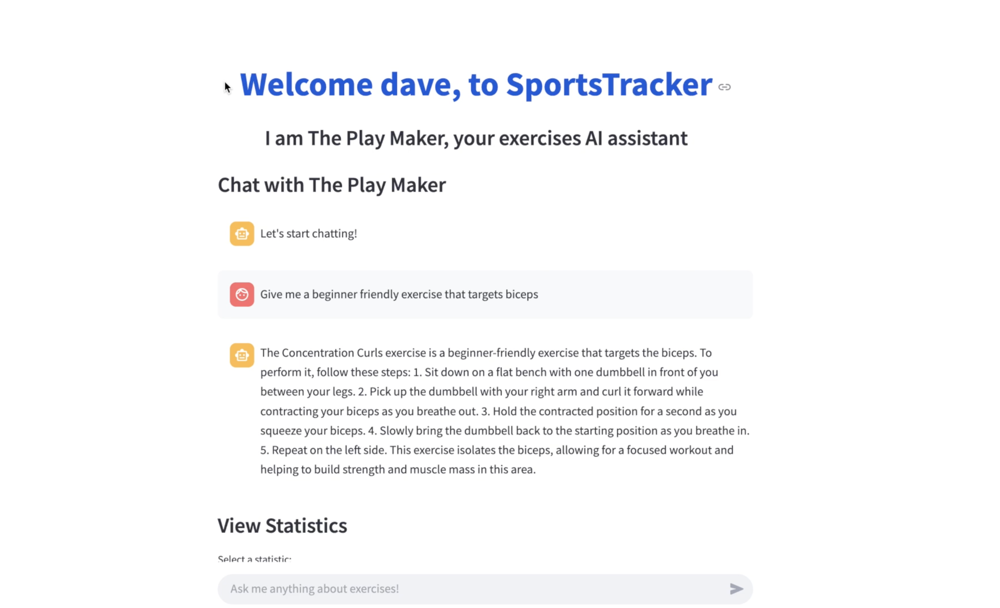

# Sports Tracker

Sports Tracker is a full-stack web project primarily focused on backend development as part of the Database Systems course at UPRM. The project uses Python and PostgreSQL, with a complete workflow from database design to frontend integration.

---

## Table Diagram

*The above image illustrates the database schema and relationships.*

---

## Phase 1: Database Design and ETL

- Created tables in PostgreSQL according to the table diagram with all necessary relationships.
- Performed ETL (Extract, Transform, Load) processes using pandas to upload and clean the data provided by the professor and teaching assistants.
- Ensured data consistency and integrity during the import process.

---

## Phase 2: REST API Development

The second phase focused on building a robust backend REST API using Flask and following the MVC (Model-View-Controller) pattern.

### Architecture and Implementation

- The API was implemented from scratch without using any ORM, providing direct control over SQL queries and database transactions.
- **Data Access Objects (DAOs):** Handled direct interactions with the PostgreSQL database for all CRUD operations.
- **Route Handlers (Controllers):** Managed HTTP requests, routed them to DAOs, and constructed appropriate responses.
- **Extensive validation and error handling** were added to ensure data integrity and reliable operation.

### CRUD Operations

The API supports Create, Read, Update, and Delete operations on the following main tables:

- **Athlete**
- **Sport** (Reading includes related exercises)
- **Exercise** (Includes instructions, image paths, primary and secondary muscles)
- **Team**
- **Championships** (Includes winner team information)

### Relationship Management

The API allows adding and removing relationships between:

- Exercise and Sports
- Exercise and Instructions
- Exercise and Images path
- Exercise and Primary muscles
- Exercise and Secondary muscles

### Analytics Endpoints

#### Team & Sports Analytics
- `GET /teams/top-teams`: Returns the top 3 teams with the most championships won.
- `GET /teams/sports-distribution`: Counts teams per sport.
- `GET /sports/popularity`: Ranks sports by the number of registered athletes.
- `GET /championships/most-wins`: Lists teams with the highest championship victories.

#### Exercise & Training Trends
- `GET /exercises/most-performed`: Top 5 most performed exercises.
- `GET /exercises/muscle-group?muscle={muscle_text}`: Lists exercises targeting a specific muscle.
- `GET /exercises/most-complex`: Exercises that target the highest number of different muscle groups.

### Data Validation & Error Handling

- Prevent duplicate athletes or teams.
- Validate required fields.
- Ensure foreign key constraints are respected.
- Handle errors for:
  - Invalid IDs in queries (HTTP status code: 404).
  - Attempting to delete referenced records (HTTP status code: 409).
  - Missing parameters in requests (HTTP status code: 400).

---

## Phase 3: Frontend and Chatbot Integration

- Developed a frontend using Streamlit, chosen for its simplicity and Python compatibility.
- Implemented sign-in and login functionalities, adding a new table to the database for client information with encrypted passwords.
- The main page displays dynamic statistics generated from aggregate queries that update according to the data.
- Features include options such as Team & Sports Analytics and Exercise & Training Trends.

### Chatbot

- Integrated a chatbot using LLAMA and LangChain.
- Created a vector table in PostgreSQL with pgvector to store chunked exercise information as vectors.
- The chatbot features short-term and long-term memory.
- Workflow:
  1. User submits a question via the frontend.
  2. Backend sends the question to IBM’s Granite 3.3 model to paraphrase, considering previous question history.
  3. The paraphrased question is embedded and used to query the vector database for the 5 most similar documents.
  4. The Llama 3.2 model answers using those documents.
  5. Upon user logout, the conversation is saved to the database and reloaded on next login.

---

## Technologies

- Python, Flask, PostgreSQL, pandas
- Streamlit for frontend development (run locally)
- LLAMA and LangChain for chatbot functionality (run locally)
- Deployment on Heroku
- Docker used for testing environment setup

---

## Demo

A demonstration video of the project is available on YouTube:  
[[https://www.youtube.com/watch?v=gFGKJ1IQFt8&t=0s]]

---

